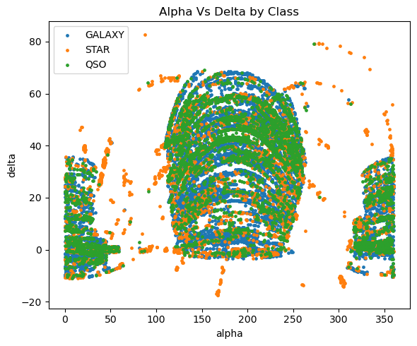
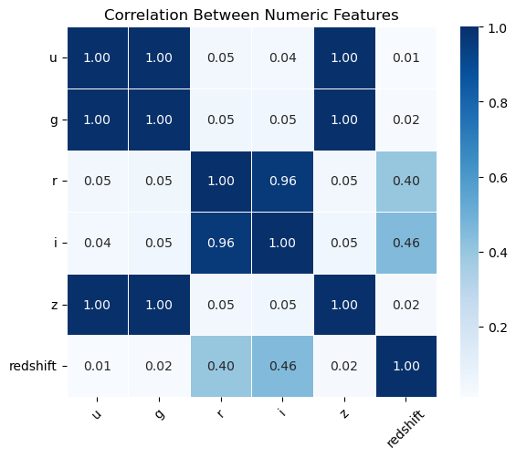
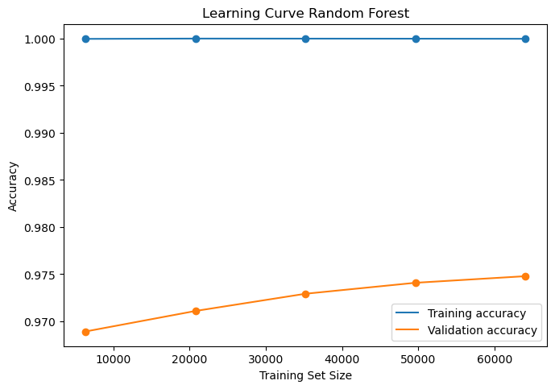

# Stellar Object Classification: SDSS DR17

[](https://colab.research.google.com/github/AsserGharib1/StellarClassificationSdss17/blob/main/stellar_classification.ipynb)
[](https://nbviewer.org/github/AsserGharib1/StellarClassificationSdss17/blob/main/stellar_classification.ipynb)

Three-class classification (galaxy / quasar / star) of **100,000 observations** from the Sloan Digital Sky Survey DR17, from raw photometry to tuned, learning-curve-audited models.

## Results (test set, GridSearchCV-tuned)

| Model | Accuracy | ROC-AUC |
|---|---|---|
| **Random Forest** | **97.63%** | **0.9952** |
| SVM (RBF kernel) | 95.66% | 0.9879 |
| Logistic Regression (lbfgs, C=50) | 96.40% | 0.9895 |

Random Forest per-class: GALAXY 0.98 precision / 0.98 recall, QSO 0.97 / 0.95, STAR 0.98 / **1.00**. Learning curves show a small train/validation gap for RF, low overfitting, with accuracy still improving with data.

## Sample outputs







## Pipeline

Leakage-safe split → mean imputation → IQR outlier analysis on the u, g, r, i, z photometric bands → redshift/band separability EDA → encoding + scaling → GridSearchCV tuning → confusion matrices, per-class precision/recall/F1, ROC-AUC, learning curves.

## Data

`star_classification.csv`, [Stellar Classification Dataset SDSS17](https://www.kaggle.com/datasets/fedesoriano/stellar-classification-dataset-sdss17) (Kaggle, fedesoriano, SDSS DR17).

```bash
pip install -r requirements.txt
jupyter notebook stellar_classification.ipynb
```
